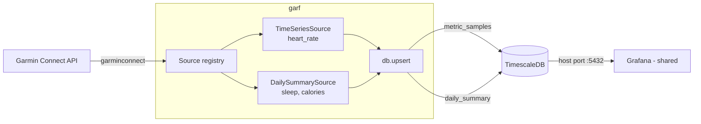

# garf — Plan v2 (decisions locked, implementation-ready)

Supersedes `plan_v1.md`. All open questions are resolved (see **Decisions**).
Background, library notes, and data-shape analysis still live in `plan_v1.md`;
this file is the build plan.

## Decisions (from plan_v1 open questions)
1. **DB engine:** TimescaleDB.
2. **Schema:** narrow `metric_samples` for intraday data.
3. **DB layer:** psycopg3 + SQLAlchemy Core (typed tables, explicit SQL, no ORM).
4. **Migrations:** Alembic (canonical pairing with SQLAlchemy Core; the wide
   `daily_summary` table will accrue columns as metrics are added — Alembic's
   strength). *Caveat:* Timescale `create_hypertable()` is hand-written in the
   migration op; Alembic won't autogenerate Timescale-specific DDL.
5. **Networking:** single laptop — Postgres publishes a host port; Grafana
   connects over the host. No shared Docker network needed.
6. **Sync resume:** trailing re-sync window (re-pull last N days every run,
   idempotent upserts). `backfill` command covers long outages.
7. **First slice:** heart rate, sleep, calories.
8. **Units:** metric, canonical on write.

## Refinement to plan_v0's base classes
plan_v0 asked for two base classes (time series + workouts). The data actually
has **three** shapes, and the first slice uses two of them:
- **heart rate** → intraday samples → `metric_samples` (`TimeSeriesSource`)
- **sleep, calories** → daily scalars → `daily_summary` (`DailySummarySource`)
- workouts → `workouts` (`WorkoutSource`) — **scaffolded interface, not built in
  slice 1**; added when we ingest activities.

So slice 1 builds `TimeSeriesSource` and `DailySummarySource`. `WorkoutSource`
is designed-for but deferred (keeps the slice small per your simplicity-first rule).



## Schema (slice 1)
```sql
-- intraday samples (hypertable on ts)
metric_samples(
  ts     timestamptz      not null,   -- UTC
  metric text             not null,   -- 'heart_rate'
  value  double precision not null,
  primary key (metric, ts)
);

-- one row per date; sources upsert only their own columns
daily_summary(
  day                 date not null primary key,
  resting_hr          int,
  sleep_score         int,
  sleep_duration_s    int,
  total_kilocalories  int,
  active_kilocalories int,
  bmr_kilocalories    int
);
-- workouts: created later with WorkoutSource
```
Exact source keys (`totalKilocalories`, `dailySleepDTO.sleepScores`, etc.) are
pinned against a captured JSON fixture during step 5, since `garminconnect`
returns raw pass-through dicts.

## File structure
```
garf/
  config.py            # env: DATABASE_URL, tokenstore path; metric vs imperial
  client.py            # build_client() -> Garmin (auth = placeholder)
  db.py                # SQLAlchemy Core engine + MetaData + upsert helpers
  models.py            # Core Table defs: metric_samples, daily_summary
  sources/
    base.py            # Source (ABC), TimeSeriesSource, DailySummarySource
    heart_rate.py      # HeartRate(TimeSeriesSource) -> metric_samples
    sleep.py           # Sleep(DailySummarySource) -> daily_summary cols
    calories.py        # Calories(DailySummarySource) -> daily_summary cols
    __init__.py        # REGISTRY = [HeartRate(), Sleep(), Calories()]
  sync.py              # CLI: trailing-window `sync` + `backfill <start> <end>`
  tests/
    fixtures/          # captured raw API JSON
    test_transforms.py
migrations/            # alembic
docker-compose.yml     # TimescaleDB, named volume, host port
grafana/provisioning/  # postgres datasource (dashboards deferred)
.env.example
```

## Implementation steps (in order, each with a verify)
1. **Deps + config.** Add `psycopg[binary]`, `sqlalchemy`, `alembic`,
   `python-dotenv` to `pyproject.toml`. Write `config.py` (reads `DATABASE_URL`,
   tokenstore path, unit system) and `.env.example`.
   *Verify:* `uv sync` succeeds; `python -c "import garf.config"`.
2. **TimescaleDB stack.** `docker-compose.yml` using `timescale/timescaledb:*-pg16`,
   named volume, published host port, healthcheck.
   *Verify:* `docker compose up -d`; `psql "$DATABASE_URL" -c '\l'` connects.
3. **Models + migrations.** Define Core tables in `models.py`. `alembic init`;
   first migration creates both tables and runs
   `SELECT create_hypertable('metric_samples','ts')` in `op.execute`.
   *Verify:* `alembic upgrade head`; both tables present, `metric_samples` is a hypertable.
4. **Client placeholder.** `client.py:build_client() -> Garmin` with a clearly
   marked auth placeholder (you fill in).
   *Verify:* returns a `Garmin` instance without error (no network).
5. **Base classes + concrete sources.** `Source` ABC: `fetch(client, day)`,
   `transform(raw) -> rows`, `table`. `TimeSeriesSource` unnests
   `[epoch_ms, value]` arrays → `(ts, metric, value)`. `DailySummarySource`
   maps raw → a `{day: ..., <cols>}` partial row. Implement HeartRate, Sleep,
   Calories. Capture one real response per source into `tests/fixtures/`.
   *Verify:* `test_transforms.py` runs each `transform` against its fixture,
   asserts row shape/types — no live API.
6. **DB upserts.** `db.py`: bulk insert-on-conflict for `metric_samples`
   (`(metric, ts)`); partial-column upsert for `daily_summary` (`day`, update
   only the source's own columns).
   *Verify:* unit test inserts fixture rows twice → no dupes, second run updates.
7. **Sync orchestration.** `sync.py`: default `sync` re-pulls a trailing window
   (configurable, default 3 days) for every source in `REGISTRY`, `sleep`s
   between dates to respect throttling; `backfill <start> <end>` does the same
   over an explicit range.
   *Verify:* against a stubbed/recorded client, `sync` writes expected rows;
   running twice is idempotent.
8. **Grafana datasource provisioning.** `grafana/provisioning/datasources/*.yml`
   pointing at the host port. Dashboards deferred until data is flowing.
   *Verify:* (with your shared Grafana) datasource "Save & test" succeeds; a
   manual query against `metric_samples` returns rows.

## Out of scope for slice 1
Workouts/`WorkoutSource`, `workout_samples`, additional metrics (stress, HRV,
body battery, respiration, steps, VO2max), Grafana dashboards-as-code. Each is
an additive subclass + (for daily scalars) an Alembic column migration.
